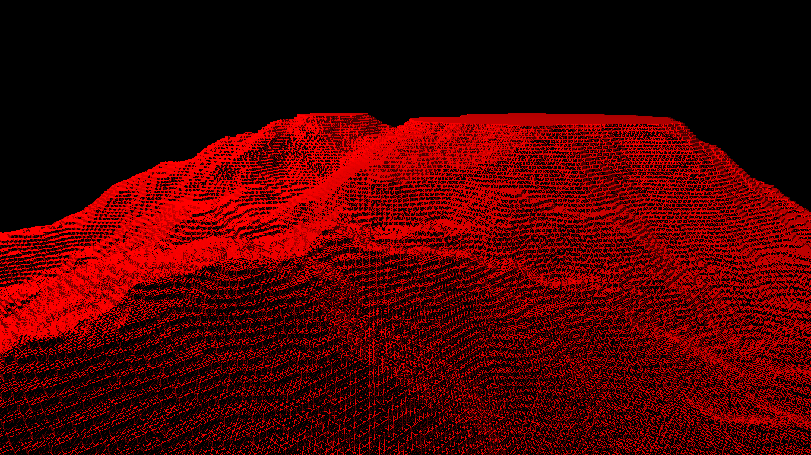

# Cubex
Playing with Voxels in SDL and OpenGL

### Features (todo)
* Perlin noise terrain generation
* Chunking
* Greedy meshing (merging faces)
* Selecting cubes/faces
* Adding/removing cubes -> rebuilding chunks
* Frustum culling

